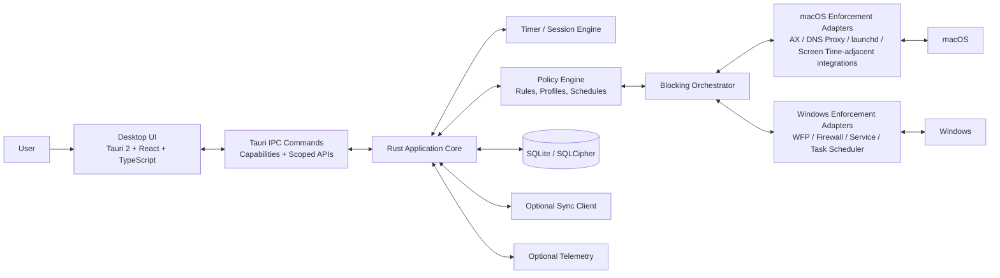

# Zen Mode Desktop App — Technical Roadmap

Build a **local-first, tamper-aware, cross-platform** focus application with a Rust-native core, thin desktop shell, deterministic timer engine, policy-driven blockers, and optional encrypted sync. The recommended architecture is Tauri 2 + Rust core + React/TypeScript UI, with a hard separation between user interface concerns and privileged operating-system integration so that blocking reliability does not depend on the frontend process staying alive.[web:17][page:1][page:2]

## 1. Product engineering goals

### 1.1 Non-functional targets
- Cross-platform parity across macOS and Windows for timers, schedules, app blocking, website blocking, tray/menu bar presence, notifications, updates, and crash recovery.
- Local-first operation: all focus sessions, rules, schedules, and block decisions must execute with no cloud dependency.
- Blocking reliability target: if the UI crashes, the blocking subsystem must remain active or recover automatically on next process start.
- Cold-start target: app shell interactive under 800 ms on a modern machine; background agent under 200 ms; idle RAM target under 150 MB for shell and under 50 MB for background blocking agent.
- User trust target: all telemetry optional and off by default in privacy-sensitive regions/use cases.

### 1.2 Product constraints
- The app must work with partial OS privileges and degrade gracefully when a permission is denied.
- The architecture must assume adversarial user behavior: force quit, permission revocation, clock changes, process kill, hosts file edits, restart loops, and network stack interference.
- The design must support direct-download distribution first, with store packaging as a constrained secondary path because several low-level blocking features conflict with store sandbox expectations.

## 2. High-Level Design

### 2.1 Recommended top-level architecture
The strongest 2026 architecture is a **split-brain desktop model**: a Tauri desktop shell for UI and non-privileged workflows, plus an OS-facing native service/agent layer responsible for enforcement, timers, recovery, and persistence orchestration. Tauri 2 runs the frontend inside the OS WebView and exposes a Rust core with a plugin-based model, capabilities, permissions, and scopes that fit this boundary well.[web:16][web:17][page:1]



### 2.2 Process model
Use **three executable roles** rather than one monolith:
- `zen-ui`: main desktop app with windows, onboarding, settings, history, reporting.
- `zen-agent`: background agent started at login, owns schedules, session state machine, tray/menu bar, notification routing, and lightweight enforcement coordination.
- `zen-elevated-helper` or platform-specific privileged component: installed only when required for network-level blocking or deep OS integration.

This decomposition isolates privileged code, reduces blast radius, and lets the UI remain replaceable without changing enforcement behavior.

### 2.3 Core components

#### UI layer
- Tauri 2 shell.
- React 19 + TypeScript 5.6+.
- Router: TanStack Router.
- Data fetching/cache: TanStack Query.
- Forms: React Hook Form + Zod.
- State boundary: server/app-state in TanStack Query; local view state in Zustand or Jotai.
- Command bridge: typed Tauri invokes generated from Rust command contracts.

#### Core engine
- Rust workspace containing domain logic, session FSM, policy evaluator, scheduler, persistence repositories, sync protocol types, and OS abstraction traits.
- No UI dependencies, no WebView assumptions, fully testable from CLI/unit tests.

#### Blocking service
- Policy evaluator converts high-level user intent into low-level enforcement artifacts: process deny rules, host/domain rules, browser-extension policies, firewall/WFP filters, DNS/proxy rules, schedule guards.
- Platform adapters implement enforcement separately for macOS and Windows.

#### Timer & scheduler
- Deterministic timer service driven by monotonic clocks for active countdown and wall-clock time for schedules.
- Persists every state transition as an append-only event stream plus compacted snapshots.

#### Persistence layer
- SQLite as system of record, WAL enabled.
- SQLCipher if you need user-configurable secure-at-rest protection for sensitive settings/journals.
- File-based sealed key material in OS keychain/credential vault.

#### Sync service
- Optional, asynchronous, eventually consistent, end-to-end encrypted.
- Must never be on the critical path for local enforcement.

#### Telemetry
- Optional privacy-safe events only: startup latency, crash signatures, feature usage, enforcement failure categories.
- Never log visited domains, blocked app names, or focus session labels without explicit consent.

### 2.4 Component interaction flow

```text
[User clicks Start Session]
    -> UI validates form locally
    -> UI invokes Rust command start_session(profile_id, duration, mode)
    -> Core Engine opens DB transaction
    -> Session FSM emits SESSION_STARTED event
    -> Policy Engine resolves effective profile/rules
    -> Blocking Orchestrator computes enforcement plan
    -> OS Adapters apply plan atomically where possible
    -> Timer Engine starts monotonic countdown
    -> Agent publishes new state to tray + UI subscribers
    -> Snapshot persisted
```

### 2.5 Data flow rules
- UI never writes directly to the database.
- UI never speaks directly to OS enforcement APIs.
- All mutations pass through the core command boundary and emit domain events.
- All enforcement plans are versioned so rollback and audit are possible.
- All timers must be reconstructable from persisted events after crash/restart.

## 3. Cross-platform OS integration strategy

### 3.1 Philosophy
Use a **policy abstraction** at the domain layer and bind it to platform-specific enforcement mechanisms at the edge. Avoid pretending the operating systems are identical. They are not. macOS is stronger for UX polish and accessibility-driven window/app inspection; Windows is stronger for deep network interception via WFP and service-based background enforcement.[page:2][web:10][web:13]

### 3.2 macOS integration strategy

#### Required surfaces
- Accessibility / AX APIs for app/window awareness, frontmost app detection, UI element inspection where justified, and potentially browser/window-title matching.
- `NSWorkspace` notifications for app launches/termination/activation.
- LaunchAgent / LaunchDaemon via `launchd` for auto-start and resilience.
- Network Extension or proxy/DNS strategy for network blocking where allowed by distribution path.
- UserNotifications for session milestones.
- Keychain for local secrets.

#### macOS notes
- Accessibility permission is essential for reliable app-level awareness and anti-circumvention UX, but it is brittle across code-signing/build changes and must be tested as part of signing/notarization flows.[web:9][web:15][web:6]
- App Store distribution is likely too restrictive if you require helper tools, low-level blocking, or broad process introspection; direct signed/notarized distribution is the more realistic primary channel.
- Treat Screen Time integration as optional and weakly coupled; do not build the core product around private or unstable integrations.

#### Recommended macOS enforcement layers
1. **App awareness**: `NSWorkspace` + Accessibility APIs.
2. **Window/title heuristic layer**: detect target browser/app windows when app-level block is insufficient.
3. **Network domain blocking**: DNS proxy / local proxy / Network Extension path if feasible.
4. **Persistence**: launch agent + watchdog heartbeat.
5. **Tamper awareness**: detect helper unload, permission revocation, agent kill, clock rollback.

### 3.3 Windows integration strategy

#### Required surfaces
- Windows Filtering Platform for robust network-layer domain/IP/app filtering; WFP is the correct modern platform for packet-processing interception and underpins Windows firewall features.[web:10][page:2]
- Windows Service for long-running background enforcement.
- Task Scheduler for recovery and login-start behavior.
- Win32 process monitoring APIs / ETW / WMI depending on depth needed.
- Toast notifications via Windows App SDK or WinRT bindings.
- DPAPI / Credential Locker for secrets.

#### Windows notes
- WFP is a development platform for network filtering, not a firewall itself, and supports firewalls, parental controls, and app-based policy at multiple layers in the stack.[web:10][page:2]
- Production-grade reliability on Windows strongly favors a service + user-mode controller pair rather than a tray-only process.
- Microsoft Store packaging is possible for the UI shell, but deep WFP/service behavior often fits direct installer distribution better.

#### Recommended Windows enforcement layers
1. **Network blocking**: WFP filters generated from canonicalized rule sets.
2. **Process/app blocking**: process creation monitoring + immediate termination or foreground suppression + launch prevention heuristics.
3. **Recovery**: service restart policies + scheduled tasks.
4. **Tamper awareness**: service stop attempts, binary replacement, permission changes, hosts/proxy divergence.

## 4. Cloud vs local-first decision

### 4.1 Recommendation
Choose **fully local-first / offline-first** as the primary architecture, with sync added later as a replicated encrypted overlay. This app’s core value proposition is focus protection, which must not fail because of network loss or server downtime.

### 4.2 Why local-first wins
- Timer precision and enforcement must remain deterministic without cloud round-trips.
- Privacy expectations are significantly higher for a blocker than for a generic productivity app.
- App-store and enterprise review both become easier when sensitive browsing/app usage never leaves the machine by default.
- Local-first architecture simplifies trust: users can understand that all blocking rules are computed and enforced locally.

### 4.3 Sync model if added
- Sync only these entities: profiles, allowed/blocked sets, schedules, preferences, devices, optional aggregate stats.
- Never sync raw visited-domain history unless explicitly enabled.
- Sync protocol: device-generated operations with lamport timestamp + vector-clock metadata or CRDT-like merge semantics for sets and maps.
- Encryption: per-account root key -> per-device wrapped key -> per-record or per-log chunk envelope encryption.

## 5. Security, privacy, and tamper resistance

### 5.1 Threat model
Your main adversary is usually the user’s future distracted self, not a nation-state. Design for **anti-circumvention**, not magical unbreakability.

Threats to model:
- Killing UI process.
- Killing background agent or service.
- Revoking accessibility or helper privileges.
- Editing hosts file.
- Changing system clock or timezone.
- Using alternate browsers or portable apps.
- Safe mode / recovery mode / another account.
- Network bypass via VPN, custom DNS, mobile hotspot, local proxy.
- Binary patching or replacing helper executables.

### 5.2 Anti-circumvention design
- Keep enforcement outside the UI process.
- Sign all binaries and validate helper versions at handshake time.
- Use challenge-response handshake between UI and agent/helper with rotating local nonce.
- Maintain a heartbeat table in SQLite and in-memory watchdog timers.
- Persist active sessions independently of the UI.
- On restart, reconstruct and re-apply active blocking plan before showing editable controls.
- Offer “strict mode” where session cancellation requires cooldown, reason code, or separate secret.

### 5.3 Secret handling
- Store encryption keys in Keychain (macOS) and DPAPI-protected store (Windows).
- Keep API tokens, sync credentials, and telemetry keys outside SQLite where possible.
- If SQLCipher is used, derive/open database key via OS secret storage plus machine/user binding.

### 5.4 Privacy architecture
- Default zero-knowledge local mode.
- Telemetry disabled by default or consent-gated on first run.
- Domain/app metadata classified into three levels: sensitive, operational, aggregate.
- Sensitive data never leaves device; aggregate counts may be uploaded only with consent.

## 6. Performance and battery architecture

### 6.1 Resource principles
- Make the UI event-driven; no polling for timer ticks faster than 1 Hz unless the timer view is visible.
- Keep process watchers incremental and subscription-based.
- Compile rule sets into efficient matcher structures: trie/radix for domains, hashed normalized process IDs/paths for apps, interval trees for schedules.
- Avoid browser-like idle costs by keeping only one visible WebView and pushing heavy work to Rust.

### 6.2 Battery guidance
- Prefer OS notifications over custom wake loops.
- Coalesce persistence writes: event append immediately, snapshot compact every N transitions or every 30–60 seconds.
- Debounce file system and process scans.
- Use monotonic sleep timers in agent/service; avoid sub-second loops.
- On laptops, avoid continuous foreground polling of window titles unless a relevant browser is active.

## 7. Tech stack recommendation and trade-off analysis

### 7.1 2026 framework comparison
Tauri 2 is stable and designed around a frontend in the OS WebView with a Rust core, permissions, scopes, capabilities, and official plugins including updater, single-instance, notifications, SQL, store, and autostart.[web:17][page:1]

Electron remains mature and widely deployable, but current stable releases track large Chromium/Node bundles and only the latest three stable major versions are officially supported, increasing upgrade discipline requirements.[web:21][web:24][web:27][web:30]

| Framework | Bundle size | Startup | Native API access | Security posture | Auto-update | macOS/Windows parity | Battery/RAM | Maintenance cost | Fit for focus blocker |
|---|---|---|---|---|---|---|---|---|---|
| Tauri 2 | Small relative footprint because it uses OS WebView instead of bundling Chromium.[web:17][page:1] | Fast when frontend is lean.[web:17][page:1] | Strong through Rust + plugins + custom native bindings.[web:17][page:1] | Good model with permissions, scopes, capabilities, and audited v2 changes.[web:17][page:1] | Built-in updater plugin ecosystem.[web:17][page:1] | Strong for macOS/Windows. | Better baseline idle footprint than Electron in typical apps.[web:17][web:1] | Moderate; Rust adds systems complexity. | **Best overall**. |
| Electron / Forge | Large because Chromium and Node ship with app.[web:21][web:24] | Typically slower cold start than WebView-based shells. | Excellent via Node/native modules. | Mature but broader attack surface due to bundled browser/runtime; requires strict hardening. | Mature ecosystem, easy deltas. | Excellent. | Higher memory/battery baseline. | Moderate-high due to upgrade cadence.[web:27][web:30] | Strong fallback if your team is Electron-native. |
| Flutter Desktop | Medium-large. | Good UI smoothness, heavier engine. | Native access via plugins/platform channels. | Good but custom engine/runtime surface. | Decent, less standard on desktop. | Good, but some desktop-native edges remain plugin-dependent. | Better than Electron in some cases, worse than native WebView in others. | Moderate. | Great UI, weaker OS-enforcement ergonomics than Rust/Tauri. |
| Rust + Wry/Tao | Small. | Excellent. | Maximum flexibility. | Strong if you build carefully. | You own more plumbing. | Good but more manual. | Excellent. | High. | Best for expert systems teams, not fastest path. |
| Qt / Qt for Python | Medium-large. | Good. | Excellent native integration. | Mature native model. | Mature but licensing/distribution trade-offs. | Excellent. | Good. | Medium-high; licensing and C++/Python complexity. | Viable for enterprise-heavy teams. |
| .NET MAUI / WinUI + Uno | Medium. | Good on Windows, more variable cross-platform. | Strong on Windows, mixed elsewhere. | Solid, especially in Windows-first estates. | Good. | Better if Windows-first; macOS parity less natural. | Good. | Medium. | Better for internal tooling than a blocker needing deep macOS parity. |
| Neutralino / NW.js / others | Small to medium. | Variable. | Usually limited or niche. | Mixed. | Mixed. | Mixed. | Mixed. | Mixed. | Not ideal for production-grade blocker. |

### 7.2 Primary recommendation
Use this stack:
- **Desktop shell**: Tauri 2.x stable.[web:16][web:17]
- **Backend/core**: Rust stable 1.86+ (pin exact toolchain in `rust-toolchain.toml`).
- **Frontend**: React 19 + TypeScript 5.6+ + Vite 6.
- **Router**: TanStack Router.
- **Data/cache**: TanStack Query.
- **State**: Zustand for ephemeral UI state; event streams from backend for session state.
- **DB**: SQLite 3.46+ via `sqlx` or `rusqlite`; SQLCipher variant if needed.
- **Migrations**: `sqlx migrate` or `refinery`.
- **Serialization**: `serde`, `schemars`, `specta` for typed contracts where useful.
- **Async runtime**: Tokio.
- **Time**: `time` crate + monotonic sources.
- **Logging/tracing**: `tracing`, `tracing-subscriber`, rolling file appender.
- **macOS native bridge**: Rust + Swift helper where Tauri plugin boundary is insufficient.
- **Windows native bridge**: Rust + C/C++ or Rust Windows bindings for WFP/service integration.

### 7.3 Why this stack
- Tauri 2 gives a small shell, strong security primitives, and enough plugin surface to avoid rebuilding common desktop glue.[web:17][page:1]
- Rust is a better fit than JavaScript or Dart for timer correctness, policy engines, service code, and OS-level adapters.
- React/TypeScript remains the fastest path to a polished settings-heavy desktop UX.

## 8. Packaging, signing, updates, and distribution

### 8.1 Recommended distribution channels
| Platform | Primary | Secondary | Notes |
|---|---|---|---|
| macOS | Direct download `.dmg` / signed app bundle | App Store only for constrained shell version | Direct distribution is better for helper tools, accessibility-driven enforcement, and custom update flows. |
| Windows | Direct `.msi` or bootstrap installer | Microsoft Store optional shell listing | WFP/service/helper requirements fit direct installers better. |

### 8.2 Signing and notarization
- macOS: Apple Developer ID signing + notarization + stapling for all shipped binaries, including helpers, login items, and privileged tools.
- Windows: Authenticode signing; EV cert strongly preferred if budget allows to reduce SmartScreen friction.
- Sign update artifacts as well as installers.

### 8.3 Auto-update strategy
- **macOS direct**: Sparkle 2 is mature, supports sandboxing-related modern architecture, secure updates, and macOS 10.13+ support.[web:22][web:25][web:28]
- **Tauri-native path**: Tauri updater plugin is attractive if you want unified update logic across desktop targets and your helper/component model fits it.[web:17][page:1]
- **Windows**: Tauri updater or MSIX/installer-managed updates; avoid Squirrel unless you have legacy reasons.

### 8.4 Release channels
Implement 4 channels:
- `dev`
- `alpha`
- `beta`
- `stable`

Each channel should have its own update feed, signing pipeline, and feature-flag defaults.

## 9. Low-Level Design

### 9.1 Domain model

#### Core entities
- `Profile`: named rule bundle.
- `BlockRule`: domain/app/category/network rule.
- `Schedule`: recurring or one-shot focus schedule.
- `Session`: active or historical focus interval.
- `SessionCheckpoint`: persisted running-state checkpoint.
- `Device`: sync identity.
- `PermissionState`: per-OS capability health.
- `EnforcementPlan`: compiled low-level plan.
- `TamperEvent`: helper stop, permission revoked, clock rollback, update mismatch.

#### Suggested Rust types
```rust
pub struct SessionId(Uuid);

pub enum SessionMode {
    Focus,
    ShortBreak,
    LongBreak,
    Strict,
}

pub enum SessionState {
    Idle,
    Preparing,
    Active { started_at: OffsetDateTime, ends_at: OffsetDateTime },
    Paused { remaining: Duration },
    Completing,
    Completed,
    Aborted { reason: AbortReason },
    Recovering,
}

pub struct EnforcementPlan {
    pub revision: i64,
    pub app_rules: Vec<AppRule>,
    pub domain_rules: Vec<DomainRule>,
    pub network_rules: Vec<NetworkRule>,
    pub strictness: Strictness,
}
```

### 9.2 Session engine design
Use a **finite state machine** with append-only events:
- `SessionRequested`
- `SessionPreparationStarted`
- `EnforcementApplied`
- `SessionStarted`
- `SessionPaused`
- `SessionResumed`
- `SessionCompleted`
- `SessionAborted`
- `CrashRecovered`
- `TamperDetected`

#### Timer correctness rules
- Countdown derived from monotonic elapsed time, not repeated decrement ticks.
- Wall clock only used for calendar schedules and UI display.
- On resume after sleep, recompute `remaining = planned_duration - monotonic_elapsed`.
- On crash recovery, reconstruct from `SessionStarted` + last checkpoint + current clock pair.

#### Crash recovery algorithm
1. Open DB.
2. Read `active_session` snapshot.
3. Validate monotonic/wall-clock delta sanity.
4. If uncertain, mark session `Recovering`.
5. Recompute effective remaining time.
6. Reapply enforcement plan before exposing controls.
7. Emit `CrashRecovered` or `TamperDetected`.

### 9.3 Website blocking mechanisms
Use **layered blocking**, not one mechanism.

| Mechanism | Strengths | Weaknesses | Recommendation |
|---|---|---|---|
| Hosts file | Simple, local, no service | Easy to bypass, weak with HTTPS/CDNs, admin friction | Use only as fallback/dev mode. |
| Local DNS proxy | Good domain-level control, local-first | Requires resolver changes, VPN conflicts, platform complexity | Good on macOS direct + Windows advanced mode. |
| System proxy / PAC | Flexible, inspect hostnames | Users/apps can bypass, TLS complications | Good supplementary layer. |
| WFP (Windows) | Robust network interception at stack layers.[web:10][page:2] | Complex, driver/service-adjacent thinking required | Primary Windows network layer. |
| Network Extension (macOS) | Strong native path | Entitlements/distribution complexity | Best long-term macOS network layer if product scope justifies it. |
| Browser extension hooks | Precise per-browser UX | Browser-specific maintenance, install friction | Add later for Chrome/Edge/Firefox to improve messaging and redirects. |

#### Domain normalization pipeline
- Lowercase.
- Punycode conversion.
- Strip trailing dot.
- Expand wildcard representation into matcher tree.
- Generate eTLD+1-aware canonical forms where needed.
- Resolve category packs into concrete domains at compile time.

### 9.4 App blocking mechanisms

#### macOS approach
- Observe running apps using `NSWorkspace`.
- Match by bundle ID, executable path hash, and signer identity where possible.
- On launch/foreground event, if blocked:
  - immediately hide/terminate if policy allows,
  - show system notification or overlay message,
  - log event.
- For browsers, use Accessibility/title heuristics to detect blocked targets when domain-level blocking is not available.

#### Windows approach
- Monitor process creation/activation.
- Match by executable path, publisher, file hash optionally.
- For blocked apps:
  - terminate process,
  - deny network if applicable,
  - prevent relaunch burst via cooldown backoff.

### 9.5 Unbreakable blocking engine design
“Unbreakable” should be implemented as **multi-layer persistence + tamper visibility**, not a claim of absolute impossibility.

#### Engine principles
- Privileged enforcement separated from editable UI.
- Active session persisted in signed/validated state snapshot.
- Reconciliation loop checks desired vs actual enforcement state.
- Policy compile step is deterministic and hashable.
- Health monitor reports partial degradation rather than silently failing.

#### Reconciliation loop
Every 5–15 seconds, or on OS event trigger:
- Read active policy revision.
- Probe OS adapter state.
- Compare actual rules/helpers/permissions against desired.
- Re-apply missing rules.
- Raise tamper event if divergence recurs.

### 9.6 Tray/menu bar/notification system
- Tauri tray/menu where sufficient; native wrappers if you need richer platform behavior.[page:1]
- macOS menu bar app mode for quick actions: start, pause, resume, strict lock, remaining time.
- Windows tray icon with context menu and toast deep links.
- Notification abstraction in Rust, with per-platform adapter.

### 9.7 Persistence and encryption

#### Database recommendation
Use SQLite with this posture:
- WAL mode.
- `foreign_keys = ON`.
- `journal_size_limit` tuned.
- periodic integrity checks.
- event table + snapshot tables.

#### Schema outline
```sql
profiles
block_rules
schedules
sessions
session_events
session_snapshots
device_state
permission_state
enforcement_state
tamper_events
sync_ops
```

#### Encryption choice
- If only storing settings/history: standard SQLite + OS keychain for secrets may be enough.
- If storing journals, sensitive categories, or E2EE sync payload cache: SQLCipher is justified.

### 9.8 Settings and profiles system
- Profiles are immutable-by-version once used in an active session.
- Edits create new profile revision.
- Effective policy compiled from: base profile -> schedule overrides -> one-off session overrides -> emergency allowlist.
- Feature flags separated from user settings.

### 9.9 Cross-device sync architecture

#### Recommended sync topology
- Thin sync service with append-only encrypted operation log.
- Each device maintains local SQLite store and sync cursor.
- Server stores encrypted blobs and metadata only.

#### Conflict resolution
- Scalar settings: last-write-wins with vector timestamp.
- Sets (blocked domains/apps): OR-set or deterministic union + tombstones.
- Schedule edits: versioned object with merge rejection when overlap ambiguity occurs; user resolves explicitly.
- Session history: never merge active sessions; device-local origin with immutable IDs.

## 10. Edge cases and defensive programming

### 10.1 Failure modes to design for
- Accessibility permission revoked during active session.
- Windows service starts before user session and cannot show UX.
- Laptop sleep/resume crosses session end.
- Timezone changes during scheduled focus block.
- Update occurs during active session.
- DB locked/corrupted.
- Browser process forks/relaunches faster than watcher reacts.
- VPN overrides DNS/proxy path.
- Multiple users logged into same machine.

### 10.2 Defensive patterns
- All OS adapters behind trait interfaces with health states: `Healthy`, `Degraded`, `Unavailable`, `PermissionDenied`.
- Every user-facing action should map to an idempotent command.
- Every command returns domain error codes, not stringly typed errors.
- DB migrations must be forward-only and dry-run tested in CI.
- Session-end logic must be safe to execute more than once.
- Update installer must defer if strict session active.

## 11. Suggested repository structure

### 11.1 Monorepo recommendation
Use a monorepo. This product has too many shared contracts to benefit from split repos early.

```text
zen-mode/
  apps/
    desktop-ui/                # Tauri app frontend
    admin-console/             # optional future sync/admin web console
  crates/
    zen-domain/                # entities, value objects, events, FSM
    zen-core/                  # use cases, policy engine, orchestration
    zen-db/                    # repositories, migrations, sqlite/sqlcipher
    zen-os/                    # shared OS trait definitions
    zen-macos/                 # macOS adapters
    zen-windows/               # Windows adapters
    zen-sync/                  # sync protocol, crypto wrappers
    zen-telemetry/             # optional telemetry client
    zen-cli/                   # internal diagnostic CLI
  native/
    macos-helper/              # Swift/XPC/helper pieces if needed
    windows-service/           # service host / WFP integration glue
  packages/
    ui-contracts/              # generated TS types from Rust contracts
    design-system/             # tokens, components
  infra/
    signing/
    update-feeds/
    installer/
    ci/
  docs/
    architecture/
    adr/
  scripts/
  .github/workflows/
```

### 11.2 Module boundaries
- `zen-domain`: zero IO.
- `zen-core`: orchestrates use cases through traits.
- `zen-db`: persistence only.
- `zen-macos` / `zen-windows`: impure adapters only.
- `desktop-ui`: no business logic beyond presentation/form validation.

## 12. State management and reactive architecture

### 12.1 Backend state model
- Single source of truth = domain state in core + persisted snapshots.
- Publish state changes via event bus.
- Tauri frontend subscribes to session/health events.

### 12.2 Frontend state model
Split into four layers:
1. Remote/app commands and queries: TanStack Query.
2. UI session stream: Zustand store fed by backend events.
3. Form drafts: React Hook Form.
4. Derived selectors: memoized computed view models.

### 12.3 Recommended reactive flow
```text
Rust domain event
 -> adapter publishes typed event
 -> Tauri emit to frontend
 -> frontend event gateway validates payload
 -> Zustand store patches in-memory state
 -> React components re-render selectively
```

## 13. Competitive technical analysis

These observations are directional, not reverse-engineered certainty.

| Product | Likely technical pattern | Strengths | Gaps to exploit |
|---|---|---|---|
| Freedom | Multi-platform cloud-backed policy sync + local blockers | Broad device coverage, mature recurring schedules | Often perceived as less “hard lock” than deep OS-native tools on desktop. |
| Cold Turkey | Windows-first aggressive enforcement, likely deep native process and network hooks | Strong anti-circumvention reputation | UX, cross-platform parity, and modern architecture can be improved. |
| Opal | Mobile-first habit interruption, polished UX | Excellent behavioral design | Desktop-native deep enforcement opportunity. |
| Serene | Focus rituals + timer UX | Good intentionality | Typically weaker hard-blocking depth. |
| One Sec | Behavioral interruption and delay mechanics | Great friction design | Less desktop-OS-level enforcement depth. |
| Focus@Will | Audio/productivity service | Strong content differentiation | Not primarily a blocker; not a systems competitor. |

### 13.1 Strategic technical gap
Win by combining:
- Cold Turkey–level seriousness in enforcement.
- Opal/One Sec–level interruption design.
- Tauri/Rust-level modern maintainability and footprint.
- Optional privacy-preserving sync.

## 14. Phased development roadmap

### Phase 0 — Setup & Foundations
**Goal:** establish the architecture skeleton, contracts, build system, and local diagnostics.

#### Milestones
1. Monorepo initialized.
2. Tauri desktop shell boots on macOS and Windows.
3. Rust workspace with domain/core/db crates compiles.
4. SQLite schema v1 and migration pipeline in place.
5. Event-driven session FSM implemented with unit tests.
6. Logging, crash capture, config loading, feature flags in place.
7. Code signing test pipeline established for dev builds.

#### Key decisions
- Lock local-first architecture.
- Define domain events before UI screens.
- Choose Tauri updater vs platform-specific update split.

#### Deliverables
- Architecture decision records (ADRs).
- Empty app shell with tray/menu bar.
- CLI diagnostic tool to inspect DB and simulate sessions.
- Build scripts for unsigned local installers.

#### Estimated effort
- 2–4 weeks for 1 strong engineer or 1–2 weeks for a small experienced team.

#### Risks
- Underestimating signing/notarization friction.
- Letting UI drive domain design too early.

### Phase 1 — MVP
**Goal:** ship a reliable single-device blocker with timer, schedules, app block lists, and basic website blocking.

#### Milestones
1. Session engine complete.
2. Profile system complete.
3. App blocking on both OSes at basic reliability.
4. Website blocking v1 using simplest viable mechanism per OS.
5. Crash recovery and login startup functional.
6. Local notifications, tray controls, history screen complete.
7. First internal alpha builds signed and installable.

#### Deliverables
- Start/stop/pause/resume timer.
- Manual sessions + recurring schedules.
- Blocked apps list.
- Blocked domains list.
- Strict mode v1.
- Health dashboard for permissions and helper status.

#### Estimated effort
- 6–10 weeks.

#### Risks
- Browser/domain blocking complexity exploding too early.
- Treating hosts-file blocking as enough for production.

### Phase 2 — Polish & Cross-platform parity
**Goal:** eliminate major platform gaps and harden enforcement.

#### Milestones
1. Windows WFP-based network blocking implemented.[web:10][page:2]
2. macOS improved app/window awareness via AX and NSWorkspace.[web:9]
3. Watchdog/reconciliation loop implemented.
4. Signed helper/service lifecycle fully managed.
5. Update flow with active-session deferral implemented.
6. Deep-link notifications and quick actions complete.

#### Deliverables
- Reliability dashboard.
- Enhanced block messages/redirects.
- Import/export profiles.
- Structured tamper event logging.

#### Estimated effort
- 8–12 weeks.

#### Risks
- macOS entitlement/distribution complexity.
- Windows service/WFP complexity requiring specialist debugging.

### Phase 3 — Advanced features & sync
**Goal:** encrypted sync, browser precision, richer analytics.

#### Milestones
1. E2EE sync protocol shipped.
2. Conflict resolution tested across multiple devices.
3. Browser extensions for Chrome/Edge/Firefox optional integration.
4. Focus analytics and streaks added locally.
5. Preset categories and curated rulesets.

#### Deliverables
- Account/device management.
- Sync health UI.
- Cross-device profile propagation.
- Analytics dashboard with privacy controls.

#### Estimated effort
- 8–14 weeks.

#### Risks
- Sync complexity destabilizing local-first guarantees.
- Analytics accidentally collecting sensitive data.

### Phase 4 — Production, testing, release
**Goal:** operationalize quality, releases, supportability, and compliance.

#### Milestones
1. Installer hardening, signing, notarization, rollback tested.
2. CI matrix stable across macOS and Windows.
3. Automated upgrade tests across 3 previous versions.
4. Privacy policy, terms, support playbooks complete.
5. Beta cohort rollout and staged updates active.

#### Deliverables
- Stable release feeds.
- Crash triage dashboard.
- Support bundle generator.
- Release checklist and incident runbooks.

#### Estimated effort
- 4–8 weeks initial hardening, ongoing thereafter.

#### Risks
- Last-mile distribution failures.
- Update bugs during active sessions.

## 15. Testing strategy

### 15.1 Test pyramid
- **Unit tests**: FSM, policy compiler, domain normalization, schedule calculations.
- **Property tests**: timer arithmetic, rule compilation, conflict resolution.
- **Integration tests**: DB migrations, repository behavior, IPC contracts.
- **Platform tests**: process detection, permission state probing, helper/service lifecycle.
- **End-to-end tests**: signed test builds on real macOS/Windows machines.

### 15.2 Blocking reliability tests
Create a dedicated matrix:
- Start session, kill UI, ensure enforcement persists.
- Start session, reboot machine, ensure recovery.
- Change system clock backward/forward.
- Revoke accessibility mid-session.
- Restart explorer/Finder equivalent surfaces.
- Launch blocked app repeatedly.
- Enable VPN/custom DNS.
- Upgrade app during strict session.

### 15.3 Automation stack
- Rust: `cargo test`, `nextest`, `proptest`.
- Frontend: Vitest + React Testing Library.
- E2E: Playwright for shell/UI where possible, plus platform harness scripts.
- Windows-specific integration harness in PowerShell.
- macOS integration harness in Swift/bash.

## 16. CI/CD pipeline recommendation

### 16.1 Pipeline stages
1. Lint.
2. Type-check.
3. Rust unit/integration tests.
4. Frontend tests.
5. Build desktop artifacts.
6. Sign artifacts on protected runners.
7. Smoke-install on clean VMs.
8. Publish to channel feed.

### 16.2 GitHub Actions outline
- Matrix: `macos-14`, `windows-2025` or latest stable hosted/self-hosted equivalent.
- Cache Rust, pnpm, cargo registry, target dirs conservatively.
- Separate privileged signing jobs with OIDC or secret manager retrieval.
- Generate SBOM and checksums per release.

### 16.3 Branching and release flow
- `main` always releasable.
- `release/*` for stabilization.
- Signed beta on every tagged release candidate.
- Progressive rollout percentages for stable channel.

## 17. Release and update strategy

### 17.1 Update rules
- Never force update during strict session.
- Allow deferred update at session completion.
- Keep helper/service backward compatibility for at least one minor version.
- Support DB migrations with rollback snapshot.

### 17.2 Rollout plan
- Internal dogfood.
- 5% beta cohort.
- 25% stable canary.
- 100% stable after error budget holds for 48–72 hours.

## 18. Security and privacy best practices

- Use least-privilege helper design.
- Harden Tauri capabilities and scopes; expose only explicit commands to the frontend.[web:17][page:1]
- Disable unused plugins and shell access by default.
- Use CSP on frontend assets even in desktop context where possible.
- Validate all frontend-to-Rust payloads with schema validation.
- Redact secrets and sensitive rule values in logs.
- Provide local “privacy export” showing exactly what data is stored.

## 19. Accessibility, dark mode, and zen UX implementation

### 19.1 Accessibility
- Respect reduced motion.
- Full keyboard navigation for timer controls and profile editor.
- Screen-reader naming for tray/menu items and timers.
- High-contrast mode support.

### 19.2 Dark mode and calm UI
- Native theme detection bridged to frontend tokens.
- Use smooth but minimal transitions; no distracting animation during active focus sessions.
- Keep a distraction-free compact session window and optional full-screen countdown mode.

### 19.3 UX mechanics that help technical goals
- Health status page for permissions/services reduces support cost.
- Explain why a block happened with technical transparency, not vague messaging.
- Offer “grace period before strict lock” only as an explicit profile option.

## 20. Future extensibility

### 20.1 Plugin system
Design internal plugin seams even if you do not expose third-party plugins initially.

Potential extension points:
- Rule pack providers.
- Browser integrations.
- Team policy providers.
- Audio/focus scene modules.
- AI-assisted schedule suggestions.

### 20.2 AI features worth adding later
- Local-only distraction prediction from session metadata.
- Smart schedule recommendation.
- Natural-language rule creation parsed entirely on-device if possible.

Do not put AI on the critical path of enforcement.

## 21. Common pitfalls to avoid early

- Building the UI first and discovering the OS model later.
- Depending on hosts-file blocking as the main production mechanism.
- Mixing timer logic into frontend state.
- Treating macOS and Windows as one abstraction too early.
- Shipping helper/service code without full signing/notarization rehearsal.
- Logging too much sensitive behavioral data.
- Making sync mandatory.
- Underestimating updater/helper compatibility.

## 22. Immediate implementation checklist

### Week 1
- Create monorepo.
- Scaffold Tauri 2 app.[web:16][web:17]
- Create Rust crates: `zen-domain`, `zen-core`, `zen-db`, `zen-os`.
- Implement session FSM and event store.
- Add SQLite schema and migrations.

### Week 2
- Add tray/menu bar shell.
- Add typed command bridge.
- Build settings/profile CRUD.
- Implement local notifications.
- Add startup/login item support.

### Week 3
- Implement app-blocking adapter prototypes on both OSes.
- Build enforcement plan compiler.
- Add crash recovery path.
- Add health diagnostics page.

### Week 4
- Implement website-blocking v1.
- Add tamper event logging.
- Package signed internal alpha builds.
- Run first real-machine reliability matrix.

## 23. Final technical recommendation

Build Zen Mode as a **Tauri 2 desktop shell over a Rust-first enforcement platform**, with SQLite-backed event sourcing, a background agent, and OS-specific enforcement adapters that intentionally diverge where macOS and Windows need different low-level tactics. Use local-first architecture as the invariant, add encrypted sync only after single-device reliability is proven, and treat anti-circumvention as layered resilience plus tamper visibility rather than marketing promises of perfect unbreakability.[web:17][page:1][web:10][page:2]
